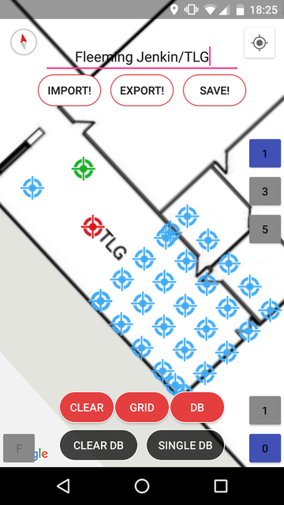
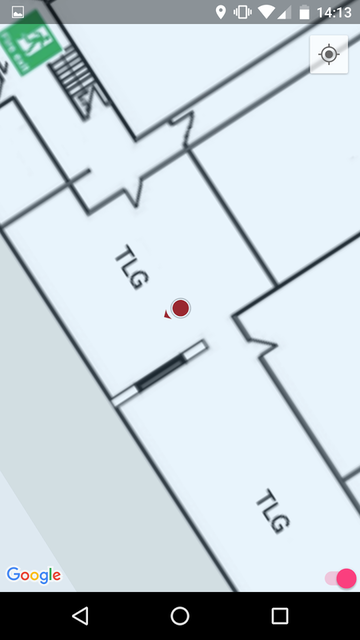
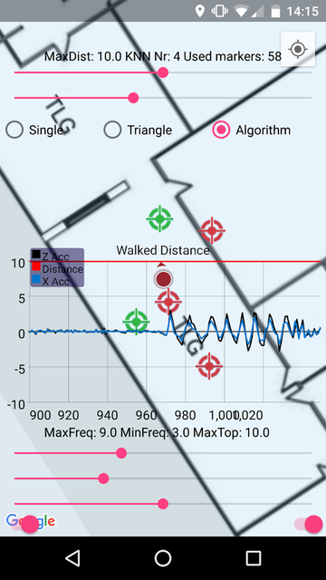
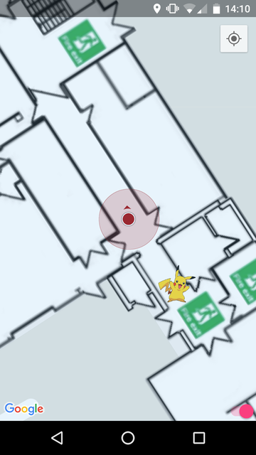
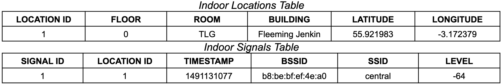

# What the hell is this?

Well, we all know what GPS is (I hope so?) and some of you might have also noticed its limitations... It works great when navigating in a car or walking outdoors, however the thing simply falls apart when you go indoors. Why would that happen you may say? Well, GPS signal believe it or not doesn't travel very well through walls, ceilings, you might even have trouble navigating in a forest with many trees. When that happens we have to rely on alternative approaches. And since pretty much every building in a modern society is equiped with a bunch of Wifi modems on every corner, it might be a great idea to use these to replace the GPS. Add motion sensors and you can get a pretty decent indoor GPS system!

This project aimes to implement a fully working indoor positioning system for one of the University of Edinburgh buildings. It uses Wifi and motion sensors for tracking, Google Maps for tracking the user on the map and a barometer for switching between different floors. Basically, the aim is to have a fully working prototype which can be used to demonstrate the capabilities of different algorithms and combining different sensors.

## Simple Positioning App

This is a very simple application that anyone can run to test wifi based positioning system based on Wifi RSSI scans. It uses KNN algorithms and correlation to try to find the correct user location (If I remember correctly it also uses trilateration).

## Indoor Positioning App

IndoorPositioning app implements some hard core logic about how indoor positioning works. It uses Wifi, Google Maps, motion sensing barometer... Figures below (also thanks github for not allowing me to style my images...) shows the created windows for the application. The intro activity is shown in figure 1. Button _TRAIN!_ leads to window 2 and _POSITION!_ will open window 3. The switch at the bottom-right side enables debug mode while in positioning mode (button “DEBUG!” will appear which opens window 4. That allows to tweak parameters to optimise positioning algorithm. The final window is of a mini built-in game of finding the hidden pikachus (aka _Pokemon Go!_, just indoor version..).

<div>
  
  
  
  
  
</div>

### Training Window
The user is provided with an empty map with the ground overlay of Fleeming Jenkin building (university of Edinburgh). To collect the WiFi data the user needs to perform such steps:
1) The map has to be populated with at least a single marker (blue target icons in figure 2) at the location where the collection is to be performed. This is done by clicking on the intended location on the map, performing a long click on that same location or by pressing the button “GRID”. In the latter the user has to put top-left, top-right and bottom-left markers on the map in this specific order and then the rest of markers will be generated automatically in a nice grid manner as shown in figure 1.b. This allows easy population of markers on the intended test location.
2) Then one of the markers have to be selected, which will change the color of it to red.
3) The user then has to go to that specific location inside the building.
4) Building/Room has to be entered in the text field provided at the top of the window e.g. Fleeming Jenkin/TLG.
5) The number of WiFi scans is to be specified with the buttons on the right side of the window (1/3/5).
6) Button _SAVE!_ starts collecting WiFi signals. Every collected signal is automatically saved in the database.
7) If more scans are needed, press scan again as previous entries in database are not deleted.
8) To clear the markers ONLY from the screen (not the database) simply press button _CLEAR_.
9) If the user intends to delete all data, collected in a single location from the database, he needs to select the marker of that location and press button _SINGLE DB_. Then confirmation alert dialog will open to confirm the action.
10) If all of the database is to be deleted, the user can press button “CLEAR DB”, which will open a confirmation dialog asking to enter the correct password. The password is 2468.
11) If the database is not empty, all saved data can be brought back to screen by pressing the button “DB”.
12) To view all of the collected signals in any location, press that location marker and then press the button “T” at the bottom-left side of the screen. If data not available, “F” will be shown instead of “T”. This will open up a dialog window with all collected SSIDs and their average signal strengths.
13) When the ground floor of the building is scanned fully, press the button “1” at the bottom-right side of the screen to open up the first floor of the building and scan it as well.
14) After all of the building is scanned, press the button “EXPORT!” and in the opened dialog enter the name for the database to be exported in the shared directory folder named “IndoorDatabase”.
15) To import another database press “IMPORT!”. Choose ES File Explorer File Manager App (install from google play store), then navigate to the intended database file and select import option as File Way. This will override the previous database in the App. The first time the App is opened, Fleeming Jenkin building database is imported automatically.

### Positioning Window
Window 3 will open and whenever the person enters the building, a red-dot will appear in the user's location and will track him while he travels inside. The red transparent circle will show the accuracy of the WiFi predictions. When the user exits the building the red-dot will disappear. The whole time Google blue-dot is shown to give Google estimated location. Several important features to mention:
1) The switch at the bottom-right side enables red-dot tracking (always position it in the screen center) while moving.
2) If anywhere on the screen the map is pressed, the phone will speak out the building, room and the floor level of the user. This helps to navigate for people with disabilities such as blindness.
3) Whenever the user changes the floor, the map will update with the ground overlay for that floor. This is achieved using a barometer sensor.
4) Five Pikachu pokemons (one shown in figure 1.e) are hidden within the map. When user gets 5 meters of closer to one of them, the pikachu image will appear on the screen and then user has to press it. Pokemon will then speak out _Pikachuuu!_, will disappear and then the number of captured pokemons will be shown. To restart the game enter _POSITION!_ mode again.

### Debug Window
The user can modify several parameters which will allow him to enhance the positioning. Top options are responsible for WiFi based positioning and bottom ones are used to improve the step counter. Additionally, an accelerometer graph is drawn to show user walking patterns.
1) KNN algorithm can be improved by changing MaxDistance in meters value (how far should train location be from the current location to be treated as a valid location) and KNN number (number of the top-highest signals used to calculate euclidean distance). Additionally 3 different algorithms can be tested being Single (user’s location is directly in one of the trained spots), Triangle (middle of the top-three most likely locations) or the Algorithm (will be discussed in later sections).
2) Step counter has parameters MaxFreq which allows to prevent fast shaking from being detected as walking, MinFreq is similar, however for slow movements and MaxTop allows to disregard huge peaks as being valid signals which do not appear in normal walking conditions.
3) Whenever the location is being predicted, 3 markers will appear showing the top-three most likely locations and blue markers will show the next two likely locations.
4) Whenever the user presses anywhere on the screen, the red-dot will be shifted to that location to test how well the algorithm handles situations where one of the locations is being identified incorrectly.
5) Switch at the bottom-left side hides the acceleration graph from the view and stops updates for it to save battery.

### Code Structure
The whole application is subdivided into multiple modules shown in figure 2. It has 3 activities, shown in red, 4 modules used between Training and Positioning Activities interchangeably, shown in green, and two modules used in Positioning Activity only, shown in blue. (SplashActivity is the intro activity). Each module purposes:
1) Constants.java stores methods and constants used throughout the activity but which have a small purpose only.
2) WifiCollector.java and the rest classes are used to collect WiFi signals and perform algorithms on WiFi data. This includes processing the data coming from the database, sorting it either by average or median, performing the KNN algorithm and positioning algorithms (Triangle and Algorithm).
3) IndoorMapManager.java and the rest classes are used to initialise and control the objects related to indoor navigation. This includes uploading the floor maps for the building, addition of markers for collecting WiFi signals, creating and controlling the red-dot (current indoor location). In addition, Pokemon games are controlled using AnimalManager.java class.
4) IndoorDatabaseHelper.java and the rest classes are used to manage the database for the application. This includes adding new locations and signals to two tables of the database, deleting single location entry, deleting the whole database, importing from the phone and exporting to the phone the current database.
5) MotionSensorManager.java is used to collect and process motion sensor data. This includes accelerometer, pressure and rotational vector sensors.
6) LocationUpdater.java class is responsible for interaction with GPS modules. This is an intended behaviour so that when the user goes from indoor to outdoor location, the more correct GPS signals should be used.

<div>
  
  
</div>

### Sensor Processing
1. The Accelerometer sensor was used to create a custom step counter. This will be used for non-training based positioning, where it will predict the user location based on it’s walking patterns and the rotation of the phone. Not all of the phones implemented a step counter sensor, plus even if one exists, it doesn’t work very well, thus a custom step counter sensor was implemented. Firstly we need sensor manager (a), then get the sensor (b) and register its listener (c). Then in the onSensorChanged(...) method we receive data. We also find acceleration projectiles to the gravity axis Z (e) and walking direction axis X (f). Acceleration array is the raw data coming from the sensor. A step is recorded whenever the totalAccelZ reaches some threshold == 4 and then goes back to 0. Throughout this time totalAccelX is being integrated and the product is equal to the stepSize used later. Several conditions are checked to make sure that person is actually walking and not turning or shaking the phone. This includes maximum step frequency, minimum step frequency, maximum totalAccelX value and maximum totalAccelZ value.
```
(a) SensorManager mSensorManager = (SensorManager) getSystemService(Context.SENSOR_SERVICE); 
(b) Sensor mAccelSensor = mSensorManager.getDefaultSensor(Sensor.TYPE_LINEAR_ACCELERATION);
(c) sensorManager.registerListener(this, mAccelSensor, SensorManager.SENSOR_DELAY_UI);
(d) float alpha = 0.8f;
(e) totalAccelX = Math.sin(Math.toRadians(pitch)) * acceleration[2] - Math.cos(Math.toRadians(pitch)) * acceleration[1];
(f) totalAccelZ = Math.sin(Math.toRadians(pitch)) * acceleration[1] + Math.cos(Math.toRadians(pitch)) * acceleration[2];
```
2. Rotation vector (accelerometer, gyro & magnetometer) sensor was used to calibrate the gyroscope sensor (Game Rotation Vector), which was used to identify the direction of walking of the user. This is being used together with the step counter to update users’ location in real-time. Both of the sensors worked using the steps thus only rotation vector was shown. The sensor had to firstly be defined (a) and listener registered (b). In the onSensorChanged method the sensor returns a vector value (rawRotationValues) and we need to translate that to rotation matrix (rotationMatrix) (c). This however will create a gimbal lock effect when some sensor values are reached, which can be eliminated by remapping the rotation matrix to another coordinate system (d). We can then get the orientation of the sensor from the rotation matrix (e), which also needs to be scaled in the range from 0˚ to 360˚, where mod is defined as % operation, PI=Math.PI and TWO_PI=2*PI 5) & f). Similarly orientation[1] represents roll and orientation[2] represents pitch.
```
(a) Sensor mRotationSensor = mSensorManager.getDefaultSensor(Sensor.TYPE_ROTATION_VECTOR);
(b) sensorManager.registerListener(this, mRotationSensor, SensorManager.SENSOR_DELAY_UI);
(c) SensorManager.getRotationMatrixFromVector(rotationMatrix, rawRotationValues); 
(d) SensorManager.remapCoordinateSystem(rotationMatrix, SensorManager.AXIS_Y, SensorManager.AXIS_X, remappedRotationMatrix); 
(e) SensorManager.getOrientation(mRotationMatrixFromVector, orientation); 
(f) float degree = (float) mod(orientation[0] + TWO_PI,TWO_PI) * 180.0 / PI; 

```
3. Pressure sensor was used to detect floor changes. Firstly the sensor had to be declared (a) and listener registered (b). As pressure values were noisy, a low pass filter was implemented identically as to accelerometer sensor (c, d). Even after filtering calculated altitude values were jumping 0.5m. The proposed floor detection algorithm made several assumptions. If the user changes the floor, this is to be done in 15 seconds or less. Also assumed floor height is more than 2m. Basically, 30 altitude values were collected every half of a second (15 seconds in total) and whenever the first value difference from the last value is 2m (ABS), the floor detection is recorded. When this happens, the list used to collect altitudes is cleared and everything starts from the beginning. 2m threshold is due to jumpy pressure sensor values and to account for the fact that some users may take longer to cross the floor. Altitude from pressure was calculated using (e).
```
(a) Sensor mPressureSensor = mSensorManager.getDefaultSensor(Sensor.TYPE_PRESSURE);
(b) sensorManager.registerListener(this, mPressureSensor, SensorManager.SENSOR_DELAY_UI);
(c) float alpha = 0.8f;
(d) float pressure = alpha * pressure + (1 - alpha) * rawPressureValues[0];
(e) float altitude = getAltitude(SensorManager.PRESSURE_STANDARD_ATMOSPHERE, pressure);
```
4. WiFi was used to perform fingerprinting based positioning, which required to scan the building before positioning. It also helped to identify  when the user gets indoors and outdoors. To use Wifi Scanner, a WifiManager instance has to be retrieved (a). To start scanning simply call a method (b). To collect scan results a BroadcastReceiver has to be implemented (c).
```
(a) WifiManager wifi=(WifiManager)context.getSystemService(Context.WIFI_SERVICE);
(b) wifi.startScan();
(c) private class WifiScanReceiver extends BroadcastReceiver {...};
```

### Data Processing
Before positioning could be performed the whole collected data in the database had to be parsed in an easily manageable data structure. The data from the database was of List<IndoorSignal> type, where IndoorSignal has a reference to its IndoorLocation. This data was parsed into Map<IndoorLocation, List<ProcessedSignal>> for quick access during the process of positioning. Here we now have a IndoorLocation as a HashMap key, which stores all of the signals in List<ProcessedSignal> grouped by their BSSIDs.
WiFi based positioning was performed using KNN (k-nearest neighbors) algorithm 1. The algorithm is very widely used for positioning purposes and the formula is given in equation 1. There k is the number of the signals / routers used in the calculations, which usually varies from 2 to 6. Then q is the collected signal strength in dBm coming from one of the routers during the positioning state. Finally, p is the signal for that same router collected during the training state. Only the signals, having the highest dBm are used in the calculations, thus WiFi signals, collected during the positioning state, have to be sorted in decremental order beforehand. The result from the equation is euclidean distance d, which has to be calculated for all of the potential locations.
<figure>
  
  <figcaption>Eq 1 - Euclidean distance calculation.</figcaption>
</figure>
Calculating euclidean distance for all of the locations in the building is an unnecessary task knowing that the user can never jump too far away from its previously predicted location. Thus we only need to evaluate the trained locations which are within the specified distance, which was predetermined to be 10 meters but could easily be amended in the debug mode. This will also give stability for the system ensuring that there are no jumps during the positioning. Three algorithms were proposed for determining the current user location:
1) The current user location is the one having the smallest euclidean distance. For this no function needs to be written, however such an approach is simplistic and will only have precision as high as there are train locations.
2) The current location is the middle of the triangle of the 3 top-smallest euclidean distances having locations. Formula given in equation 2, where x is the latitude and y is the longitude. This is a more advanced as it considers more points.
3) The best result is given when all of the potential locations are taken into account. Each location has to be weighted by their euclidean distances and the formula for that is given in equation 3. There d is euclidean distance for that train location and m is the total number of considered locations. The approach idea was found in.

<figure>
  
  <figcaption>Eq 2 - Triangle based method for evaluating current user location.</figcaption>
</figure>
<figure>
  
  <figcaption>Eq 3 - Weighted method for evaluating current user location.</figcaption>
</figure>

Finally, as WiFi signals are not as trustworthy as motion sensors, the estimated location is a weighted combination of both, shown in equation 4. This first requires us to find xmotion & ymotion, which are evaluated using the equation 4. There xcurr and ycurr are the current location of the user on the map. stepSize is evaluated using an accelerometer. Angle is the rotation angle coming from the calibrated gyroscope sensor. This formula assumes that the user holds his phone in front of him. Weights 0.000009 and 0.000016 are used to scale latitude and longitude for Edinburgh, so that stepSize would be in meters. In the worldwide based application this could be calculated using a GPS sensor.

<figure>
  
  <figcaption>Eq 4 - Motion sensor based location estimation.</figcaption>
</figure>
<figure>
  
  <figcaption>Eq 5 - Combined weighted sensor approach for estimating of the user location.</figcaption>
</figure>

### Database Structure
SQLite was used to create a database to store locations and signals captured in these locations. The structure of the database with a single example entry is shown below. Two tables were implemented, one saving the location only and the second saving all of the signals captured in every location. The signals table knows which signal belongs to which location through LOCATION ID column. All of the data was captured in order to later try different algorithms to find which one works the best. For the state of the art, 170 locations in the ground floor and 100 locations in the first floor of Fleeming Jenkin Building were scanned in total, storing almost 15,000 of WiFi signals. The locations included labs TLG, TLF, TLK, TLA, TLB and TLC, corridors and several rooms open for student access.


